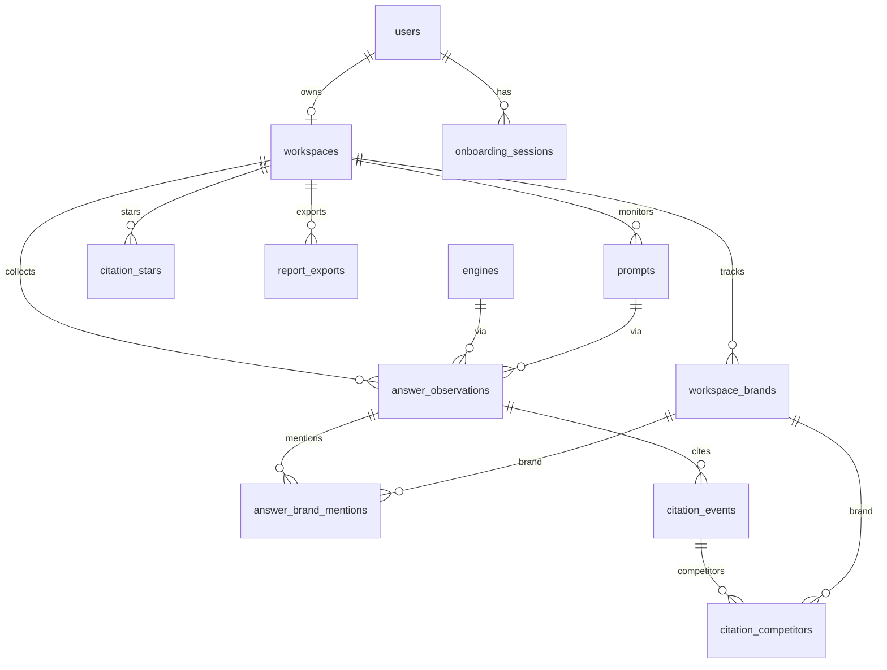

# Orbis 本地存储方案

> 版本：2026-08-07  
> 库：MySQL 8（本地 `orbis`）  
> ORM：Drizzle（[`db/schema.ts`](../db/schema.ts)）  
> 目的：支撑 Onboarding / Workspace 配置，以及 Otterly 同类 Overview · Citations · Prompts 报表；后续改表先对照本文再改 schema。

---

## 1. 设计原则

1. **配置少表、事实两层、聚合先算**  
   先不建多套日汇总表；Overview / Citations / Prompts 从事实表 SQL 聚合。量上来再加 `*_metrics_daily`。
2. **长表，不宽表**  
   竞品数量会变，禁止 `ebay_mentioned`、`facebook_cited` 这类宽列；一律 `brand_id` 行式存储。
3. **导出 ≠ 主存**  
   Otterly 宽 CSV、PDF 只作导入校验或导出产物；权威数据在配置表 + 事实表。
4. **Workers 兼容**  
   vinext 跑在 Cloudflare Workers / Miniflare：连接用 `mysql2` + `disableEval: true`，按请求短连（[`db/index.ts`](../db/index.ts) `withDb`）。
5. **时间写入格式**  
   MySQL `DATETIME(3)` 使用 `YYYY-MM-DD HH:mm:ss.sss`，不要带 `T`/`Z`。

---

## 2. 分层总览

```text
L0 账号     users / workspaces / onboarding_sessions
L1 配置     workspace_brands / prompts / engines
L2 事实     answer_observations + answer_brand_mentions
            citation_events + citation_competitors + citation_stars
L3 聚合     obs_metrics_daily / brand_metrics_daily / prompt_metrics_daily
            domain_metrics_daily / url_metrics_daily
L4 导出     report_exports（可选，文件元数据）
```



---

## 3. 表说明

### 3.1 账号与 Onboarding

#### `users`

| 字段 | 说明 |
|------|------|
| id | UUID；由 `POST /api/auth/bootstrap` 签发 session 时 ensure；可与 localStorage 提示一致 |
| email | 预留 SIWC，可空 |
| first_name / last_name / role / source | Onboarding 画像 |

#### `workspaces`

| 字段 | 说明 |
|------|------|
| owner_user_id | 账单/主拥有者（UNIQUE 暂保留）；访问控制以 `workspace_members` 为准 |

#### `workspace_members`

| 字段 | 说明 |
|------|------|
| workspace_id + user_id | 复合主键 |
| role | `owner` / `member` |

身份：HttpOnly 签名 Cookie `orbis_session`（`SESSION_SECRET`）。`x-orbis-user-id` 仅用于 bootstrap 提议 userId，**不可**单独授权。  
本地导入数据可用 `ORBIS_DEV_OPEN_TENANT=1` + `POST /api/workspaces/claim`（生产勿开）。

#### `onboarding_sessions`

| 字段 | 说明 |
|------|------|
| draft_json | 完整 `OnboardingState` 快照，便于恢复向导 |
| screen / processing_index / tour_index | 进度 |
| completed_at | NULL = 进行中草稿 |

**流程：** 向导每步 → `PUT /api/onboarding` 写草稿；完成 → `POST /api/onboarding/complete` 事务写入 workspace / brands / prompts，并标记 session 完成。  
`localStorage`（`orbis_onboarding_v1`）仅作离线兜底。

---

### 3.2 配置层

#### `workspace_brands`（本品 + 竞品合一）

| 字段 | 说明 |
|------|------|
| role | `primary` \| `competitor` |
| name / domain | 品牌名与根域名 |
| market / language | 主要写在 primary 上 |
| mark / color / sort_order | UI |

约束：`UNIQUE(workspace_id, domain)`。  
Onboarding 完成时：本品 → primary，竞品列表 → competitor（同 domain 会去重）。

> 历史表 `brands` / `competitors` 已废弃并迁入本表。

#### `prompts`

| 字段 | 说明 |
|------|------|
| text / sort_order / is_active / source | 监测问题 |
| market | 如 `uk`、`中国大陆` |
| tags | JSON 数组 |
| intent_volume | 可空，如 `1 - Very low` |

#### `engines`

字典表。已种子：`chatgpt` / `perplexity` / `google` / `gemini` / `copilot`，以及国内巡检常用的 `deepseek` / `doubao` / `gpt`。  
脚本：[`scripts/seed-engines.sql`](../scripts/seed-engines.sql)。

---

### 3.3 事实层（GEO 监测核心）

#### `answer_observations`

**粒度：`workspace × prompt × engine × market × date`**  
表示「某天某引擎对某题的一次监测结果」。

| 字段 | 说明 |
|------|------|
| observed_on | 观测日 `DATE` |
| answer_text | 答卷正文（可选；inspection 导入写入） |
| raw_path | 相对原始 `response.json` 路径 |
| model / channel / run_ts | 模型名、采集通道（如 `chatgpt-search`）、批次时间戳 |
| UNIQUE(workspace_id, prompt_id, engine_id, market, observed_on) | 防重复；同日多跑保留更大 `run_ts` |

#### `answer_brand_mentions`

某次 observation 下，各品牌是否在 **AI 回答中被提及**。

| 字段 | 说明 |
|------|------|
| brand_id | → `workspace_brands.id` |
| mentioned | 0/1 |
| position / sentiment | 可空，支撑平均位次、情感 |

支撑：Prompts 宽表里的 `* mentioned`、Overview 的 Mentions / Coverage / Rank / SOV。

#### `citation_events`

**粒度 ≈ Otterly Citations CSV 一行**（同答卷下的一条引用 URL）。

| 字段 | 对应 CSV |
|------|----------|
| url / title / position | Url / Title / Position |
| domain / domain_category | Domain / Domain Category |
| brand_mentioned_on_page | Brand Mentioned on Cited Page（`yes`/`no`/`na`） |
| times_cited | Times cited（导出行常为 1） |

约束：`UNIQUE(observation_id, url)`；`url` 最长 512（utf8mb4 索引长度限制）。

#### `citation_competitors`

引用页上出现的竞品：`(event_id, brand_id)`。  
对应 CSV `Competitors Mentioned`。

#### `citation_stars`

用户收藏 URL，与监测事实分离：`UNIQUE(workspace_id, user_id, url)`。

---

### 3.4 导出（可选）

#### `report_exports`

| 字段 | 说明 |
|------|------|
| kind | 如 `overview` / `citations` |
| filters_json | 生成时过滤条件 |
| file_path | `local:ws/id.pdf` / `s3:ws/id.pdf`；旧值 `client-download` 表示仅本机下载未上传 |
| generated_at | 生成时间 |

不存 PDF 内每一 section 的大 JSON；需要冻结快照时再扩展。

---

## 4. 与 Otterly 数据形态的对应

| 来源 | 落点 |
|------|------|
| inspection `response.json` + `batch_index.csv` | → 按品牌建 workspace；`prompts` / `answer_observations`（含正文）+ 文末引用解析 → `citation_events`；本品名/域名匹配 → `answer_brand_mentions`。脚本：`pnpm db:import-inspection` |
| Citations CSV（日×引擎×Prompt×URL） | → `answer_observations`（去重建）+ `citation_events`（+ competitors） |
| Prompts 宽 CSV（Prompt×竞品列） | **不落宽表**；由 `answer_brand_mentions` + `citation_events`（按 brand.domain）聚合；导出时再 PIVOT |
| Overview PDF | 全部由 L2 聚合；文件元数据可进 `report_exports` |

### 常见指标怎么算

| 指标 | 算法（概念） |
|------|----------------|
| Brand Mentions | `COUNT` 提及行 / 或 observation 上 mentioned=1 |
| Brand Coverage % | 含该品牌的 observation 数 / observation 总数 |
| Share of Voice % | 本品 mentions / 全品牌 mentions |
| Avg Position | `AVG(answer_brand_mentions.position)` |
| URL Cited | `SUM(citation_events.times_cited) GROUP BY url` |
| Domain Cited | 同上按 `domain` |
| Your domain cited | citation 的 domain = primary.domain |
| Competitor cited | citation 的 domain = 该竞品 domain |
| Brand rank | 窗口内按 mentions（或 SOV）排序 |

---

## 5. API（已实现 / 规划）

### 已实现（配置）

| 方法 | 路径 | 说明 |
|------|------|------|
| GET/PUT | `/api/onboarding` | 草稿读写 |
| POST | `/api/onboarding/complete` | 提交配置 |
| POST | `/api/onboarding/reset` | 清草稿 |
| GET | `/api/workspace` | 当前工作区 + primary brand + prompts + competitors |

身份：签名 Cookie `orbis_session`（须 `credentials: "include"`）。Bootstrap：`POST /api/auth/bootstrap`。

### 已实现（监测）

| 方法 | 路径 | 说明 |
|------|------|------|
| GET | `/api/workspaces` | 当前用户 **member** 且有监测数据的工作区 |
| POST | `/api/workspaces/claim` | 仅 `ORBIS_DEV_OPEN_TENANT=1`：认领导入工作区 |
| GET | `/api/workspace?workspaceId=` | 按 id 读配置（须为 member） |
| GET | `/api/metrics/overview` | 总览：覆盖趋势、提及/位次 KPI、Ranking、象限、域名引用、建议 |
| GET | `/api/metrics/prompts` | Prompt 覆盖率 / 提及 / 域名引用矩阵 |
| GET | `/api/metrics/prompts/:id` | Prompt 答卷详情（抽屉） |
| GET | `/api/metrics/citations` | URL 主表 + 域名份额；Winners/Losers 单日为空 |
| GET | `/api/metrics/brands` | 品牌矩阵（总览已内嵌 ranking，侧栏不再单独入口） |

查询参数：`workspaceId` 或 `slug`；可选 `engine`、`q`、`market`；**时间窗** `days`（默认 30）或 `from`/`to`（`YYYY-MM-DD`）。

侧栏 **品牌报告**：总览 / Prompts / 引用 / 建议。建议页复用 overview `actions`。前端总览优先加载；Prompts / 引用按需懒加载。

与 Otterly Overview 板块对照：

| Otterly | Orbis |
|---------|--------|
| Brand Coverage Over Time | overview.trend（本品 + Top 竞品） |
| Brand Mentions / Avg Position | overview.primaryMentions / avgPosition |
| Brand Ranking | overview.ranking |
| Top Prompts by Mentions | overview.topPromptsByMentions |
| Visibility 象限 | overview.ranking 散点（无时间轴播放） |
| Domain Coverage / Citation / Share | overview.domainCoverage 等 |
| Citations URL 表 | `/api/metrics/citations` urls[] |
| Recommendations | 侧栏「建议」← overview.actions |

环比：等长上一窗对比（L3）；KPI `delta`、Citations Winners/Losers 由日表计算。筛具体引擎时回退 L2 + 日期窗。

数据管道：

1. `pnpm db:import-inspection` → L2 答卷 / 引用 / 本品 mention（结束时挂钩日汇总）  
2. `pnpm db:enrich-monitoring` → 竞品品牌、全品牌 mention、引用分类（结束时重建日汇总）  
3. `pnpm db:simulate-history` → 模拟多日 L2，并按日重算 L3  
4. `pnpm db:rebuild-daily` → 全量/按 workspace 重建日汇总  
5. 看板 → **无引擎筛选时读 L3**；Prompt 抽屉仍读 L2  

### 仍偏演示

- Prompt 研究、报告中心（模板）  
- Agents analytics、象限时间轴播放（刻意不做）  

查询性能：日期窗 + L3 日汇总 + 前端分阶段加载。日表不含 engine 维度（一期）。

---

## 6. 本地环境

# .env.local（每台机器单独一份，不要提交）
DATABASE_URL=mysql://用户:密码@127.0.0.1:3306/库名
# 主机必须是 127.0.0.1，不要写 localhost


Schema 源文件：[`db/schema.ts`](../db/schema.ts)。  
变更后优先改 Drizzle schema，再用 SQL/`drizzle-kit push` 同步（注意 push 在非 TTY 下对「删表/改名」可能交互失败，复杂变更可手写 SQL）。

---

## 7. 刻意不做（控复杂度）

| 不做 | 原因 |
|------|------|
| 竞品宽表物理表 | 竞品一变就要改表 |
| PDF section 快照表 | 先 `report_exports` 元数据即可 |
| 独立 `markets` 表 | 初期 `market` 字符串够用 |
| 日表带 engine 维度 | 一期 engine-agnostic；筛引擎时回退 L2 |

---

## 8. 后续优化备忘

按需演进，建议顺序：

1. ~~inspection 原始答卷导入~~（`pnpm db:import-inspection`）  
2. Citations CSV 导入 / 对账  
3. 用 Prompts 宽 CSV 做聚合对账；补竞品 mention  
4. ~~查询变慢再加 `brand_metrics_daily` / `url_metrics_daily`~~（已落地 L3 五表）  
   默认 Overview 已走 L3；引擎拆分与域名覆盖改为窗口内短查询，不再全表 JOIN `answer_brand_mentions`。筛单个引擎仍回退 L2。  
5. 超长正文迁 R2（当前 `answer_text` MEDIUMTEXT）  
6. SIWC：用 email 绑定 `users`，替换本地 UUID  
7. `workspaces.slug`：品牌变更时是否同步更新（当前首次写入后保留）
8. 日表增加 `engine_id` 维度（筛引擎也走 L3）

修改表结构时请同步更新：**本文档** + [`db/schema.ts`](../db/schema.ts) + README 中的 Schema 小节。
